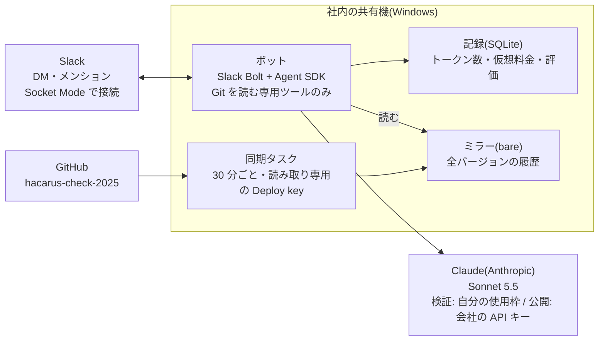
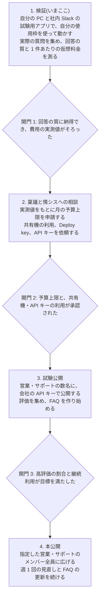

# HACARUS Check リポジトリ相談ボット 設計書

2026-10-01 · 松田

この設計書の正本はこのファイルです。仕様を変えるときは、このファイルも同じ変更で直します。

## 背景と目的

営業と技術サポートが、開発の手を借りずに HACARUS Check 2025 のリポジトリの内容を Slack で確かめられるようにする。

機能・仕様、不具合、リリース内容、導入手順の質問がいまは開発に集まり、そのたびに開発の作業が中断される。質問した側も回答を待つ間は顧客への返答が止まる。

| 成功の基準 | 測り方 |
| --- | --- |
| 開発への問い合わせが減る | 導入前後で、開発に届く営業・サポートからの質問の件数を比べる |
| 回答の評価が高い | 回答ごとの 👍 / 👎 のうち 👍 の割合 |
| 継続して使われる | 週ごとの利用者数と質問数 |

目標値は、検証フェーズの実測を見て決める。

## 利用者と利用シーン

利用者は営業と技術サポートのうち、指定したメンバーだけとする。プログラミングの知識、GitHub のアカウント、リポジトリのクローンは前提にしない。

| 利用者 | 場面 | 質問の例 |
| --- | --- | --- |
| 営業 | 顧客から機能や仕様を聞かれた | 「検査結果を CSV で出せる？」「カメラは何台までつなげる？」 |
| 技術サポート | 顧客から不具合の問い合わせが来た | 「このエラーメッセージはどういう条件で出る？」 |
| 営業・サポート | バージョンアップを案内する | 「v3.2.0 で何が変わった？」 |
| 営業・サポート | 導入や設定を手伝う | 「PLC との接続はどう設定する？」 |

質問の例は想定であり、検証フェーズで実際の質問を集めて差し替える。

## 提供形態

入口は Slack のボットへの DM と、チャンネルでのメンションにする。

- DM でボットに質問する。回答はその発言のスレッドに付き、スレッドで返信すると会話が続く。スレッドの外に送ると新しい会話になる
- チャンネルでのメンションにも答え、そのスレッドで続けられる
- スクリーンショットやログを添付して質問できる
- 検証も社内のワークスペースで、自分だけが使う試験用アプリとして行う(社外のワークスペースには社内の情報を載せない)
- 公開 URL が不要な Socket Mode でつなぐため、社内の共有機から外へ穴を開けなくてよい

Slack の AI アプリ機能(右側のパネルで、ChatGPT のように会話の一覧から選んで続けられる)にも対応できる作りにしてあるが、最初は使わない。答えられる内容は DM と同じで、違うのは会話の一覧と質問例の表示だけのため。プランや管理者の設定の確認も要らなくなる。会話の一覧が欲しいという声が出たら足す。

Slack で困ることが分かった場合は、Open WebUI など既製の Web チャット画面に、ボットを「1つのモデル」として登録する案に切り替える。ChatGPT に近い画面とログインの仕組みが最初からあり、ローカル LLM との並列比較もしやすい。回答を作る部分は入口と切り離して作るので、どちらになっても作り直すのは入口だけで済む。

CLI は営業が使わないため、管理者が設定や集計を確かめる道具にとどめる。

## 機能要件

回答は「分かりやすさ」を最優先にし、非エンジニアがそのまま顧客対応に使える言葉で結論から答える。

| 機能 | 内容 | 使う人 | 入れる段階 |
| --- | --- | --- | --- |
| 質問への回答 | 結論を 1〜3 文で先に書き、専門用語は言い換える。根拠にしたファイルを末尾に添える | 利用者 | 検証 |
| 会話の継続 | 同じスレッドの質問は前のやり取りを踏まえて答える | 利用者 | 検証 |
| チャンネルでのメンション | 人どうしの議論の途中でメンションされたら、そのスレッド(スレッドの外なら直近1時間)の直前の発言を背景として読んで答える | 利用者 | 検証 |
| 添付ファイル | 質問に添付されたスクリーンショットやログを読んで答える。ZIP や PDF などは読まずにその旨を示す | 利用者 | 検証 |
| 社外と共有したチャンネルでの拒否 | Slack コネクトのチャンネルでは答えず、DM へ案内する。答えるチャンネルは設定で絞れる | 管理者 | 検証 |
| 答えられないときの案内 | コードから確かめられないことは推測せず、「開発メンバーに確認してください」と書く。開発へ自動で転送はしない | 利用者 | 検証 |
| 回答の評価 | 回答ごとに 👍 / 👎 のボタンを付け、押された結果を記録する。👎 のときは理由を一言だけ任意で書ける | 利用者 | 検証 |
| FAQ | 👍 が多い回答や繰り返し聞かれる質問を管理者が FAQ にまとめ、ボットは最初に FAQ を引く。回答が速く安くなる | 管理者 | 試験公開 |
| 利用者の制限 | 許可したメンバー以外からの質問には断りの返事をする | 管理者 | 検証 |
| 利用状況の集計 | 件数、評価、仮想料金を Slack の /qa-cost と CSV で見られる | 管理者 | 検証 |

Slack 上では、調べている間も「調べています」と表示し、反応がないように見えないようにする。

## バージョンの指定と比較

利用者は質問ごとに対象のバージョンを指定でき、2つのバージョンを比べる質問(マイグレーションの要否など)にも答える。営業と技術サービスは顧客ごとに違うバージョンを扱うため。

- 指定の仕方: 質問の文中に書く(「v3.2.1 で…」「v3.2.1 から v3.3.2 に上げると…」)。指定がなければ最新の正式リリースをもとに答える
- 回答の冒頭に、どのバージョンをもとにしたかを必ず書く(「v3.3.2 時点の内容です」)
- バージョンによって答えが変わりそうなのに指定がないときは、先に顧客のバージョンを聞き返す
- 2つのバージョンの比較では、その間の変更ファイル、ファイルごとの差分、コミット履歴、RELEASE_NOTE.md を読み、「何が変わったか」「設定やデータの移行が要るか」を答える

| 種類 | タグの例 | 扱い |
| --- | --- | --- |
| 正式リリース | v3.3.2、v3.2.1.4 | 既定。指定がなければ最新の正式リリースを使う(現在は約 45 個) |
| ベータ | v4.0.0-beta1 | 指定されたときだけ使い、「ベータ版」と明記する |
| 開発中 | develop | 指定されたときだけ使い、「未リリースの内容」と明記する |
| 対象外 | -rc、-test、-issue、-hotfix が付くタグ、vixio- や trace-tool- など別製品のタグ | 使わない |

バージョンごとにファイルを展開すると 1 つ約 230MB × 約 45 個になるため、展開はしない。ミラーは作業ツリーを持たない Git リポジトリとして全履歴を持ち、エージェントは「バージョンを指定してファイルを読む・検索する・一覧を見る・差分を見る」専用ツールだけで中身を見る。

## 権限とセキュリティ

ボットはリポジトリに一切書き込めず、リポジトリの外も読めない。どれか1つの設定を誤っても変更できないよう、次の層を重ねる。

| 層 | 対策 | 防ぐこと |
| --- | --- | --- |
| GitHub の認証 | 書き込み権限を付けない Deploy key でミラーする | push |
| ファイルの権限 | ボットは専用の Windows ユーザーで動かし、ミラーには読み取り権限だけを与える | ミラーの書き換え、既存ボットの .env など共有機上の他のファイルの参照 |
| エージェントのツール | バージョンを指定して Git の中身を読む専用ツールだけを渡す。Bash、Edit、ファイルを直接読むツールは存在しない状態で起動する | コマンドの実行、ファイルの編集 |
| パスの検査 | 専用ツールは許可したバージョンとリポジトリ内のパスだけを受け付け、Git は決めた読み取りコマンドだけを実行する | 認証情報や環境変数の読み取り |
| 設定の読み込み | リポジトリの .claude/ や CLAUDE.md、共有機の Claude Code 設定を読まない | 設定に書かれたコマンド(hooks)の実行 |
| 秘密情報 | Slack のトークンをエージェントに渡さず、回答にパスワードや接続先の値を書かないよう指示する | 秘密情報の漏えい |

顧客名や顧客固有の仕様は参照対象に含める。利用者が社内の限られたメンバーだからであり、その内容が出る回答には「社外に共有しないでください」と添える。

## 認証と課金

検証は自分の Claude の使用枠で自分だけが使い、試験公開からは会社の API キーで従量課金にする。切り替えは設定ファイルの書き換えだけで済み、コードは変えない。

| フェーズ | 認証 | Slack | 利用者 | 費用 |
| --- | --- | --- | --- | --- |
| 検証 | 自分の Claude アカウントの使用枠 | 社内のワークスペースに入れた試験用アプリ | 自分だけ | 追加なし(仮想料金を記録する) |
| 試験公開・本公開 | 会社の API キー | 社内のワークスペース | 許可したメンバー | API の従量課金 |

個人の使用枠をほかの人に使わせると Anthropic の規約に反する。そのため、次の組み合わせではボットが起動しないようにする。

- 使用枠のモードなのに、利用者に自分以外が含まれている
- 使用枠のモードなのに、API キーも設定されている(API キーが優先されて気づかず課金されるため)
- API のモードなのに、API キーがない

モデルは Sonnet 5.5 を既定にし、設定で固定する。検証と公開で同じモデルを使えば、検証で測った料金がそのまま公開後の見積もりになる。

## ローカル LLM との比較

社内の GPU サーバーで動かすローカル LLM を Claude と並べて試し、公開後の費用を下げる候補になるかを判断する。比べるのは試験公開の段階を目安にし、時期は決めない。稟議は Claude の実測だけで出す。最初の版は Claude だけで作り、比較モードはその後に足す。

- つなぎ方: ボットの仕組み(Agent SDK、読み取り専用の制限、記録)はそのままにし、接続先だけを GPU サーバー上の Anthropic 互換 API(LiteLLM や Ollama など)に切り替える。仕組みをそろえることで、結果の差をモデルの差として比べられる
- 比較モード: 1つの質問を両方に投げ、2つの回答を「回答 A / B」としてどちらのモデルか伏せて並べ、それぞれに 👍 / 👎 を付けてもらってから明かす。記録にはどちらのモデルかを残す
- 比べる項目: 👍 の割合、回答時間、途中で止まった割合、往復の回数
- 費用の扱い: ローカル側はトークン単価ではなく、GPU サーバーを占有する時間と運用の手間で評価する

| 候補 | VRAM 合計 | 動かせるモデルの目安 |
| --- | --- | --- |
| RTX A6000 × 2 | 96GB | 70B 級を量子化して長い文脈でも動かせる |
| RTX 3090 × 2 | 48GB | 30B 級まで。文脈が長いと容量が足りなくなりやすい |

どちらを使うかは、社内での利用状況を調べて決める。このボットは 1 件に 10〜20 回の往復と 10 万トークン前後の文脈を使うため、ツール呼び出しに強く長い文脈を扱えるモデルが必要になる。Claude 以外のモデルと Agent SDK の組み合わせは Anthropic の公式サポート外のため、不具合は自分たちで対処する。

## 利用記録と費用の見積もり

検証フェーズで 35 件を実測した結果、Sonnet 5.5 で 1 件あたり平均 0.055 USD(中央値 0.052、90%点 0.098、最大 0.182)だった。月の予算上限はこの実測値をもとに稟議に書く。

| 月の質問数 | 見込み(1 件あたり平均 × 件数) |
| --- | --- |
| 300 件 | 約 16 USD(約 2,500 円) |
| 600 件 | 約 33 USD(約 4,900 円) |
| 1,500 件 | 約 82 USD(約 12,300 円) |

1 USD = 150 円で換算。回答時間は 3〜22 秒だった。事前の推定(1 件 0.25 USD)の 4 分の 1 以下で、会話の続きでもキャッシュが効いて 1 件あたりの費用はほとんど増えなかった。

質問ごとに次を記録する。

- 日時、質問者、スレッド、質問文
- モデル別のトークン数(入力、出力、キャッシュ書き込み、キャッシュ読み出し)
- 往復の回数、処理時間、実際に使われた認証
- 仮想料金: 単価表とトークン数から計算した、従量課金だった場合の金額
- 回答への評価(👍 / 👎)

集計では、件数、1件あたりの平均と最大、月 300 / 600 / 1,500 件だった場合の見込みを出す。稟議には「1件あたりの平均 × 想定件数」と上限額を書く。

質問・回答・評価の記録は 1 年保存し、会話の続きに使う内部のセッション記録は 30 日で消す。

公開後は、費用を次の2段で押さえる。

- Anthropic Console で、ワークスペースの月の上限額を設定する
- 1つの質問に使える往復回数(30回)と金額(2 USD)の上限を設ける
- 1人 1 日 20 件までに制限する(設定で変えられる)

## システム構成

ボットは社内の共有機で動かし、リポジトリは共有機上の読み取り専用のミラーからだけ読む。

ボットは Slack から質問を受けると、Claude にミラーを調べさせて回答を返し、結果を記録する。ミラーを更新できるのは同期タスクだけである。共有機は既存の Slack ボットと同じ Windows 機なので、Docker は使わず、ボットと同期タスクをタスクスケジューラーで常駐させる。検証フェーズでは、同じ構成を自分の PC と社内 Slack のワークスペースに入れた試験用アプリで動かす。

## 運用

管理者(作成者)が、評価と質問ログを見て回答を直し続ける。

| 作業 | 頻度 | 内容 |
| --- | --- | --- |
| 回答の見直し | 週 1 回 | 👎 が付いた回答を読み、システムプロンプトや FAQ を直す |
| FAQ の更新 | 週 1 回 | 繰り返し聞かれる質問と 👍 の回答を FAQ に足す |
| 費用の確認 | 月 1 回 | /qa-cost で件数と金額を見て、上限に近ければ理由を調べる |
| 利用者の追加・削除 | 依頼があったとき | 許可するメンバーの設定を更新する |
| 単価の更新 | Anthropic が料金を改定したとき | 仮想料金の単価表を直す |

共有機が止まるとボットも止まる。その間、利用者は従来どおり開発に質問する。ボットとミラーの同期は、既存の Slack ボットと同じくタスクスケジューラーで起動し、共有機の再起動後も自動で立ち上がるようにする。

## 導入計画

検証、稟議、試験公開、本公開の順に広げ、各段階の間で次に進むかを判断する。

日程は未定。関門 3 の目標値は、検証と試験公開の実測を見て決める。

## 未決事項

- [ ] 成功の基準の目標値(👍 の割合、問い合わせの減り幅)を、検証の実測を見て決める
- [ ] 月の予算上限を、検証の実測を見て決める
- [ ] 共有機で動かしてよいか、専用の Windows ユーザーを作れるか(情シス)
- [ ] 社内の Slack ワークスペースにアプリを追加してよいか(情シス)
- [x] AI アプリのパネルを使うか → 最初は使わず、DM とチャンネルで始める。会話の一覧が欲しいという声が出たら足す
- [ ] 読み取り専用の Deploy key を hacarus-check-2025 に登録できるか(リポジトリの管理者)
- [x] 利用者の管理を個人の指定で行うか、Slack のユーザーグループで行うか → どちらも使える。公開後はユーザーグループで管理する想定(メンバーは10分ごとに読み直す)
- [x] 参照したファイルはバージョンとパスで示す(利用者は GitHub を見られないため)
- [x] FAQ はボットのリポジトリに Markdown で置き、管理者が更新する
- [ ] 別製品(Vixio、トレースツール)のバージョンも質問の対象にするか
- [ ] ローカル LLM に A6000 × 2 と 3090 × 2 のどちらのサーバーを使うか(社内での利用状況を調べる)
- [ ] どのローカルモデルと推論サーバーで試すか
- [ ] ローカル LLM を公開後に使うと判断する基準(Claude と比べた 👍 の割合、回答時間)
