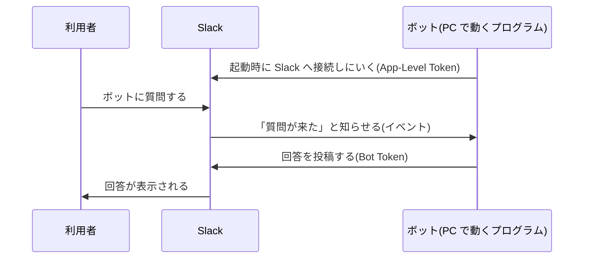

# Slack アプリの仕組みと、このボットの権限

情シスへの説明や、権限を見直すときに使う資料です。設定の実体は `slack/manifest.yml` にあります。

## Slack アプリとは

Slack アプリは、Slack の外で動くプログラムを Slack につなぐための「登録証」です。

- アプリを作ると、Slack の中に「ボットユーザー」が1人できる。このボットに話しかけたり、メンションしたりできる
- ボットの中身(質問に答えるプログラム)は Slack の中ではなく、このリポジトリのプログラムとして別の PC で動く
- アプリには、Slack で何をしてよいか(権限)を前もって決めておく。インストールするときに、管理者がその権限を承認する
- アンインストールすると、権限とトークンはすぐに無効になる

## つながり方(Socket Mode)

- ボットの PC から Slack へ接続を張り、その接続で Slack から知らせを受け取る。Slack から PC へ接続しにくることはない
- そのため、公開 URL もファイアウォールの穴あけも要らない。社内の PC から外向きの通信(HTTPS)ができればよい
- PC を止めるとボットも止まる。その間に来た質問には答えない

## 2つのトークン

| トークン | 形 | 役割 |
|---|---|---|
| Bot User OAuth Token | `xoxb-…` | ボットとして投稿したり、ボットに届いた内容を読んだりする |
| App-Level Token | `xapp-…` | Socket Mode の接続を張る。権限は `connections:write` だけ |

どちらもパスワードと同じ扱いで、`.env` にだけ書く(リポジトリには入れない)。漏れたら Slack のアプリ設定で作り直せば、古いものは無効になる。

## 権限(スコープ)

ボットが Slack でできることは、次のものだけです。

| 権限 | できること | 使う理由 |
|---|---|---|
| `app_mentions:read` | ボットがメンションされたメッセージを読む | チャンネルで「@ボット 質問」と聞けるようにするため |
| `im:history` | ボットとの DM を読む | DM で質問を受け取るため |
| `chat:write` | ボットとして投稿する | 回答を返すため |
| `commands` | スラッシュコマンドを受け取る | 管理者が `/qa-cost` で集計を見るため |
| `channels:history` / `groups:history` | ボットが参加しているパブリック・プライベートチャンネルの発言を読む | メンションされたときに、そのスレッド(スレッドの外なら直近1時間)の直前の発言を読み、「これ」が何を指すかなど質問の背景を知るため |
| `channels:read` / `groups:read` | チャンネルの情報(社外と共有されているかなど)を読む | 社外と共有したチャンネルでは答えないため |
| `files:read` | ボットが参加しているチャンネルと、ボットとの DM に貼られたファイルを読む | 質問に添付されたスクリーンショットやログを読んで答えるため |
| `usergroups:read` | ユーザーグループ(`@sales` など)の一覧とメンバーを読む | 質問できる人や管理者をユーザーグループで指定できるようにするため |

この権限では、次のことはできません。

- ボットが参加していないチャンネルのメッセージを読む
- 利用者どうしの DM を読む
- ユーザーの一覧やプロフィールを読む(ユーザーグループのメンバーの ID は読めるが、名前やメールアドレスは読めない)
- 利用者になりかわって投稿する、チャンネルを作る・消す

チャンネルの発言とファイルを読むのは、ボットがメンションされたときと、ボットに DM が届いたときだけです。読んだ発言やファイルは質問の背景として Claude に送りますが、記録(SQLite)には質問と回答、添付の数だけを残します。

## 添付ファイル

- 読むのは、質問に添付されたファイルと、チャンネルのスレッドで質問より前に貼られたファイル(文脈として読む範囲の発言のもの)
- 画像(PNG、JPEG、GIF、WebP、5MB まで)は画像のまま Claude に渡す
- テキスト(.log、.txt、.csv、.json、.xml、.ini、.yaml など、5MB まで)は中身を質問に埋め込む。Shift_JIS のログも読める。4万文字を超える分は、前の1万文字と後ろの3万文字を残して途中を省く
- 1つの質問で読むのは5個まで。ZIP、PDF、Excel などは読まず、回答の下に「読めなかった添付」として示す
- 添付が大きいほど料金が上がる。4万文字のログで、1件あたり数円〜十数円ほど増える見込み
- Claude Code の会話のセッション記録には添付の中身も残る。この記録は `SESSION_RETENTION_DAYS`(既定30日)で消える

## チャンネルでの制限

- 社外と共有したチャンネル(Slack コネクト)でメンションされても答えず、DM へ案内する
- `ALLOWED_CHANNELS` を設定すると、そのチャンネルでだけ答える。ボットはそもそも招待されたチャンネルにしか届かないので、空欄なら「招待したチャンネル」が答える範囲になる
- 往復回数と仮想料金の表示は、既定では DM だけ(`COST_FOOTER`)
- ゲスト(外部の人)が参加しているだけのチャンネルは見分けられない。ゲストのいるチャンネルにはボットを招待しない運用にする

## Slack から受け取る知らせ(イベント)

| イベント | いつ届くか |
|---|---|
| `app_mention` | ボットがメンションされたとき |
| `message.im` | ボットへの DM が届いたとき |

ほかに、評価ボタン(👍 / 👎)と 👎 の理由の入力欄を使うため、「Interactivity」を有効にしている。

## AI アプリのパネル(いまは使っていない)

Slack の AI アプリ機能を使うと、右側のパネルで ChatGPT のように会話の一覧から選んで続けられる。最初は DM とチャンネルだけで始め、会話の一覧が欲しいという声が出たら足す。

- 足すとき: manifest の `features` に `assistant_view`、スコープに `assistant:write`、イベントに `assistant_thread_started` を足してアプリを更新し(管理者の承認がもう一度要る)、`.env` を `SLACK_ASSISTANT=true` にする
- 社内の Slack のプランと管理者の設定で、AI アプリ機能が使えることを先に確かめる
- パネルを使うと、DM のスレッドでの返信もパネルの会話として扱われる

## 利用者の制限

Slack の権限とは別に、ボットのプログラム側で質問できる人を決めている(`.env` の `ALLOWED_SLACK_USERS`)。

- ユーザー ID を並べるほか、ユーザーグループ(`@sales` のようなハンドル名か、`S` で始まるグループ ID)も書ける。グループのメンバーは起動時と10分ごとに読み直すので、Slack 側でグループのメンバーを変えれば `.env` は触らなくてよい
- 管理者(`/qa-cost` を使える人、`ADMIN_SLACK_USERS`)も同じ書き方で指定できる

- 一覧にない人がボットに話しかけても、「利用できるメンバーを限定しています」と返すだけで、質問には答えない
- 検証中(`AUTH_MODE=subscription`)は、自分以外の ID やユーザーグループを書くとボットが起動しない
